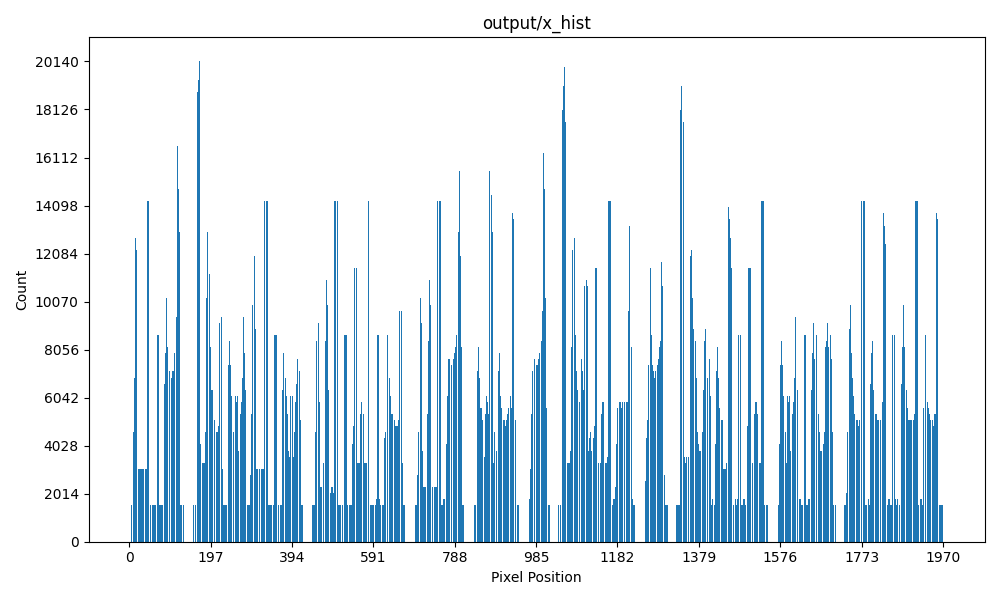
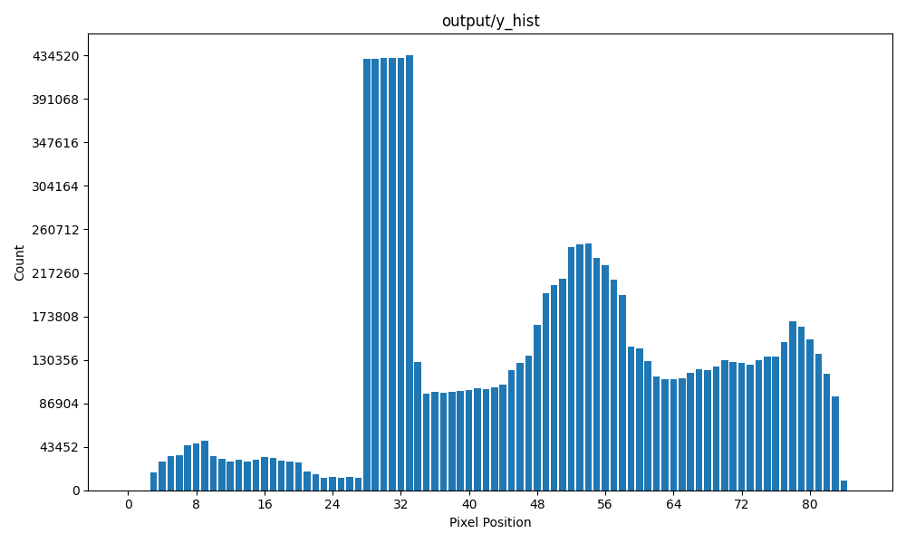
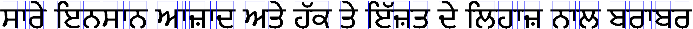

# Отчет по обработке изображения

## Введение

Процесс анализа и сегментации символов на изображении подразумевает следующие шаги: загрузка изображения, его бинаризация, анализ и визуализация гистограмм, выделение сегментов символов, их сохранение и визуализация.

## Гистограммы

### Горизонтальная гистограмма

### Вертикальная гистограмма

## Изображение с выделенными символами

## Сохраненные сегменты символов

- 
- 
- 
- 
- 
- 
- 
- 
- 
- 
- 
- 
- 
- 
- 
- 
- 
- 
- 
- 
- 
- 
- 
- 
- 
- 
- 
- 
- 
- 
- 
- 
- 
