# Отчет о характеристиках текстур изображений

## table.jpg
### Исходное изображение
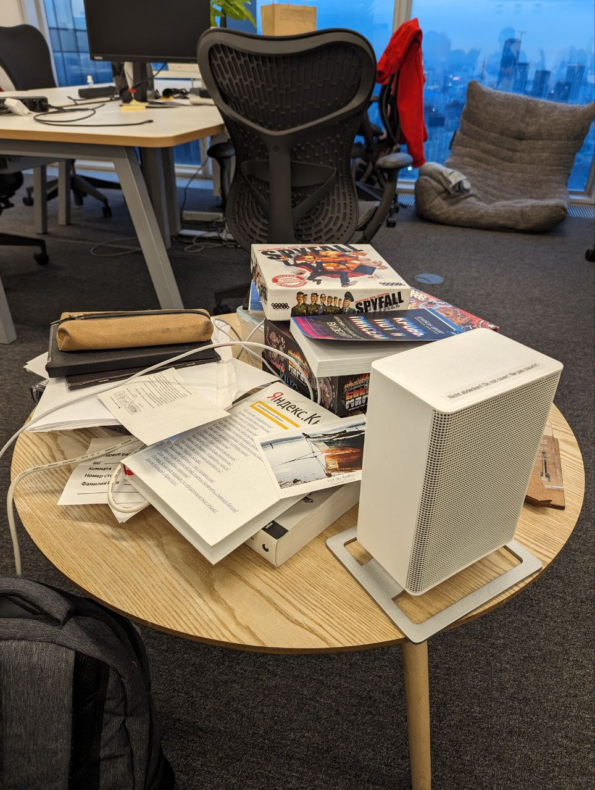

### Полутоновое изображение
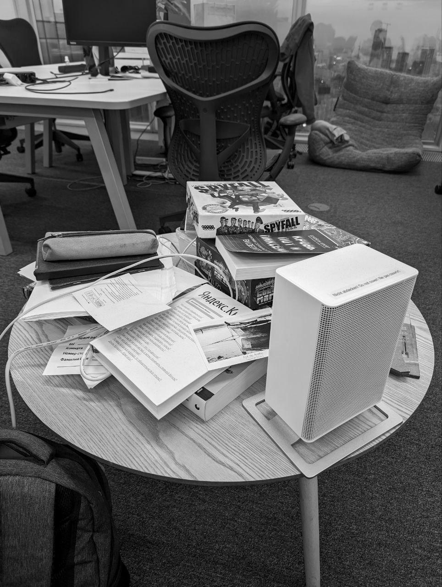

### Контрастированное изображение
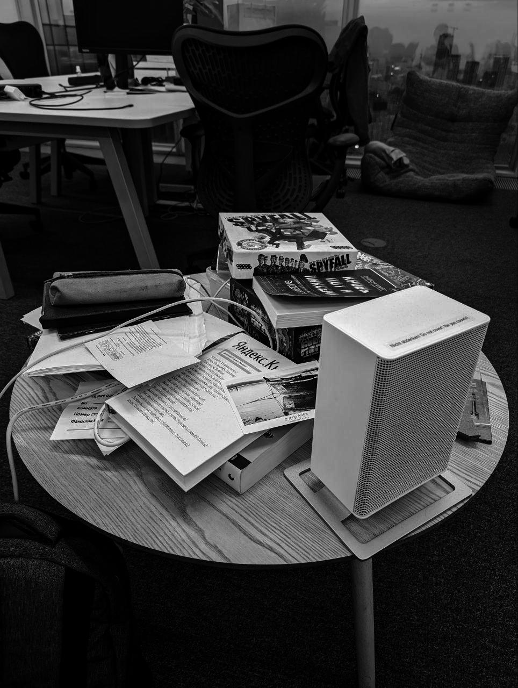

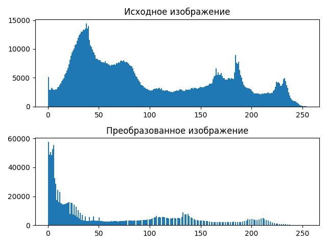

### Характеристики Харалика для исходного изображения
```
{'Asm': 365669407.4983968, 'Mpr': 256.0, 'Ent': -23260606.527321547, 'Tr': 50260.602434902234}
```

### Характеристики Харалика для контрастированного изображения
```
{'Asm': 171569515.73581597, 'Mpr': 256.0, 'Ent': -12728700.577012932, 'Tr': 30976.005188860378}
```

### Матрица Харалика для исходного изображения
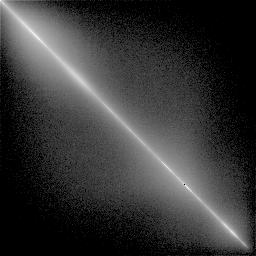

### Матрица Харалика для контрастированного изображения
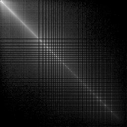

## keyboard.png
### Исходное изображение


### Полутоновое изображение
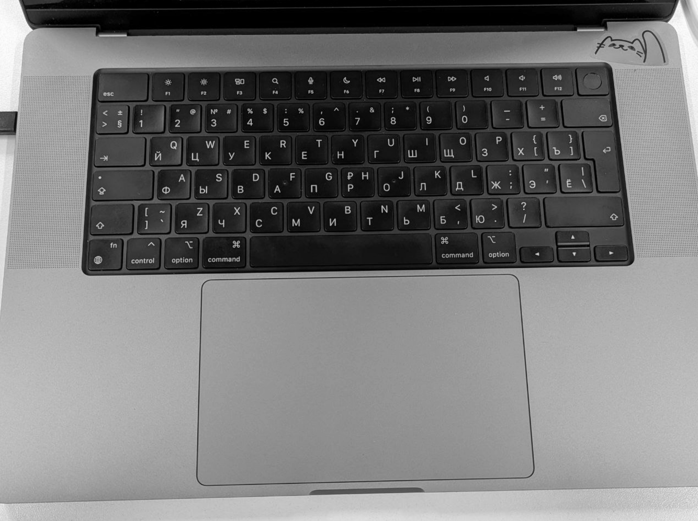

### Контрастированное изображение


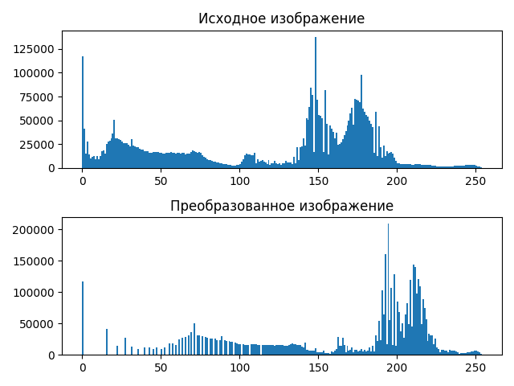

### Характеристики Харалика для исходного изображения
```
{'Asm': 191481867.46302396, 'Mpr': 256.0, 'Ent': -13568018.577920394, 'Tr': 48805.10653327904}
```

### Характеристики Харалика для контрастированного изображения
```
{'Asm': 132862634.61212511, 'Mpr': 256.0, 'Ent': -9288013.549766447, 'Tr': 37028.75809745372}
```

### Матрица Харалика для исходного изображения
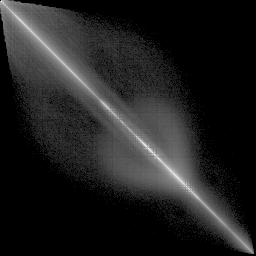

### Матрица Харалика для контрастированного изображения
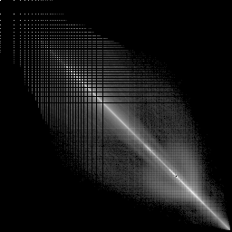

## wall.png
### Исходное изображение


### Полутоновое изображение
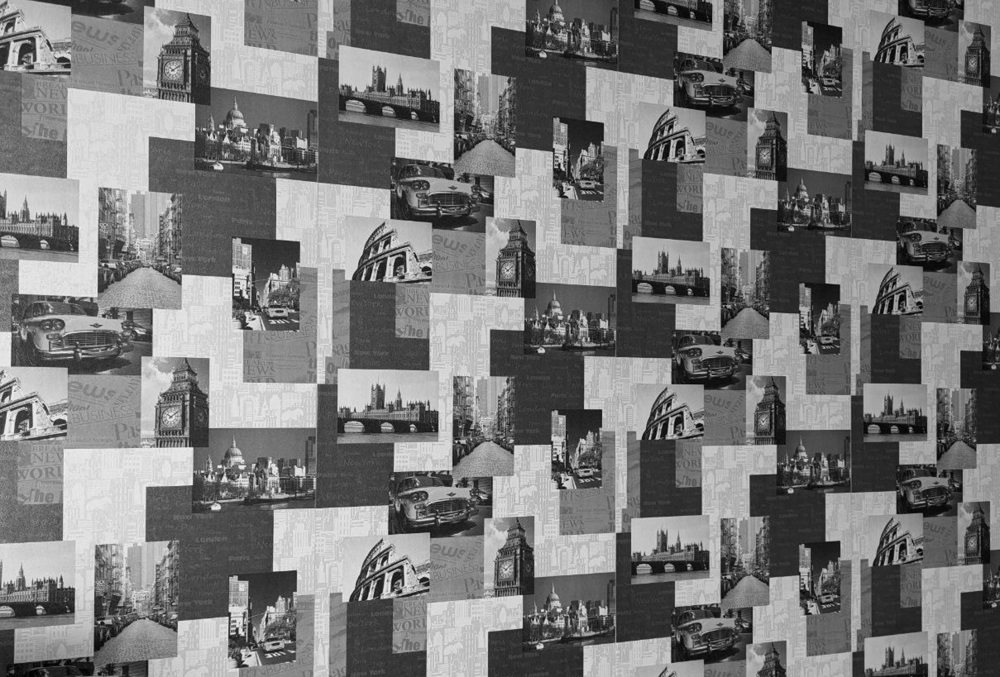

### Контрастированное изображение
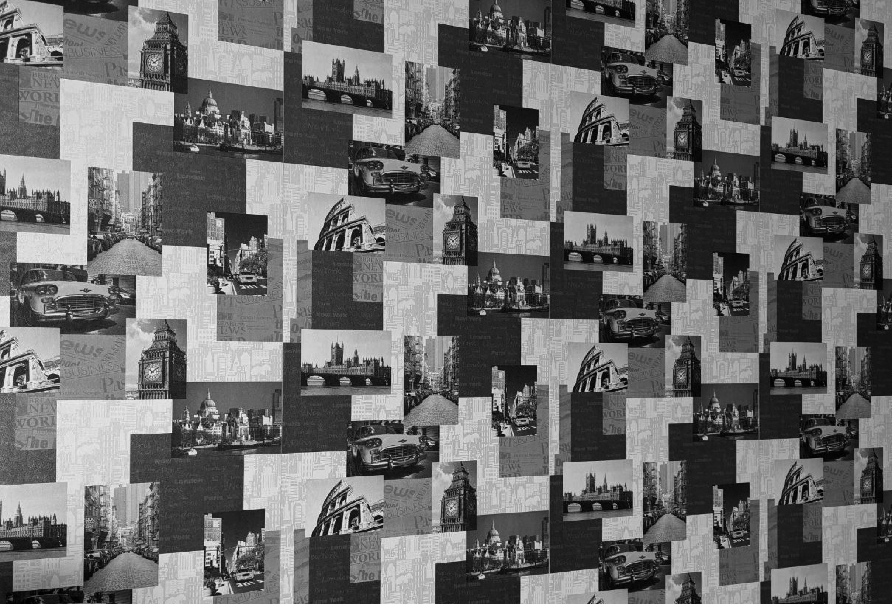

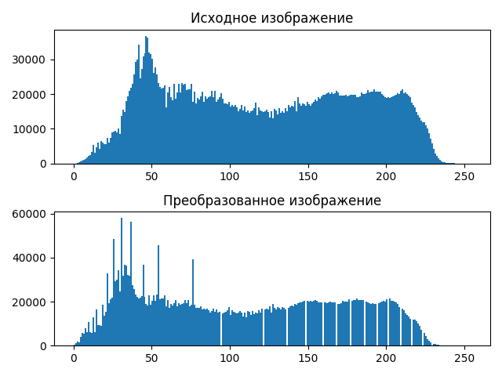

### Характеристики Харалика для исходного изображения
```
{'Asm': 380693233.02289397, 'Mpr': 256.0, 'Ent': -22515571.98369409, 'Tr': 52985.3697284523}
```

### Характеристики Харалика для контрастированного изображения
```
{'Asm': 312279595.8485668, 'Mpr': 256.0, 'Ent': -19277197.574842047, 'Tr': 46762.25908665219}
```

### Матрица Харалика для исходного изображения
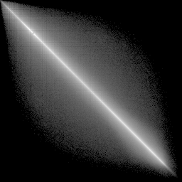

### Матрица Харалика для контрастированного изображения
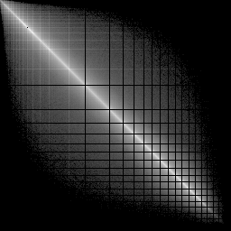

